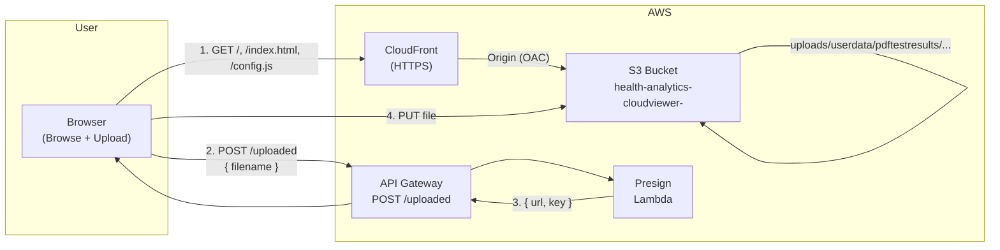

# CloudViewer – Application design

Serverless upload app: one page (Browse + Upload), presigned S3 URLs so the browser uploads directly to S3. Backend only issues a URL and never receives the file.

---

## Flow

1. User opens the site (CloudFront), selects a file, clicks Upload.
2. Browser calls **POST /uploaded** with `{ "filename": "..." }`.
3. **Presign Lambda** returns a short-lived presigned PUT URL and the S3 object key.
4. Browser **PUTs the file** to that URL (directly to S3).
5. File is stored under the upload prefix in the single S3 bucket.

---

## Components

| Component | Role |
|-----------|------|
| **Static website** | One HTML page (file input + Upload). Loads `config.js` (API base URL) and calls POST /uploaded, then PUT to presigned URL. |
| **CloudFront** | Serves the website from S3 (HTTPS). Origin uses OAC; no public read on the bucket. |
| **S3 bucket** | Single bucket `health-analytics-cloudviewer-<accountId>`. Two key prefixes: `website/` (static assets), `uploads/userdata/pdftestresults/` (user uploads). CORS allows browser PUT. |
| **API Gateway (HTTP API)** | One route: **POST /uploaded** → Presign Lambda. CORS allows the website origin. |
| **Presign Lambda** | Accepts `{ "filename" }`, sanitizes name, builds key under upload prefix, returns `{ "url", "key" }` (presigned PUT URL). |

---

## Diagram

**Data flow:**

1. **Page load:** Browser → CloudFront → S3 (`website/` prefix).
2. **Get upload URL:** Browser → API Gateway → Presign Lambda → returns presigned URL.
3. **Upload file:** Browser → S3 (presigned PUT); file lands under `uploads/userdata/pdftestresults/<userid>-<uuid>-<filename>`.

---

## Bucket layout

Single bucket; in the console you see two logical “folders”:

- **website/** — `index.html`, `config.js` (deployed by CDK; API URL injected at deploy time).
- **uploads/** — `uploads/userdata/pdftestresults/<userid>-<uuid>-<filename>` (user uploads via presigned URL).

---

## Security (current)

- Bucket: `BlockPublicAccess`; no public read. CloudFront accesses via OAC; browser uploads via presigned URLs only.
- Presign Lambda: `s3:PutObject` restricted to the upload key prefix.
- API: no auth (proof-of-concept); CORS allows `*` origin.

See [PROPOSAL.md](PROPOSAL.md#must-fix-later) for hardening (CORS restriction, auth, user identity).
